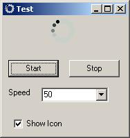



## Firefox Progress

### Description

Just trying to emulate the Mozilla Firefox

Progress Circle. Could be handy when

performing a task to let the user know

something is happening.
 
### More Info
 

             |
---                |---
**Submitted On**   |2009-04-27 13:02:54
**By**             |[Norm Cook](https://github.com/Planet-Source-Code/PSCIndex/blob/master/ByAuthor/norm-cook.md)
**Level**          |Intermediate
**User Rating**    |5.0 (20 globes from 4 users)
**Compatibility**  |VB 5\.0, VB 6\.0
**Category**       |[Graphics](https://github.com/Planet-Source-Code/PSCIndex/blob/master/ByCategory/graphics__1-46.md)
**World**          |[Visual Basic](https://github.com/Planet-Source-Code/PSCIndex/blob/master/ByWorld/visual-basic.md)
**Archive File**   |[Firefox\_Pr2150834272009\.zip](https://github.com/Planet-Source-Code/norm-cook-firefox-progress__1-72041/archive/master.zip)

### API Declarations

Stretchblt for setting the form icon

